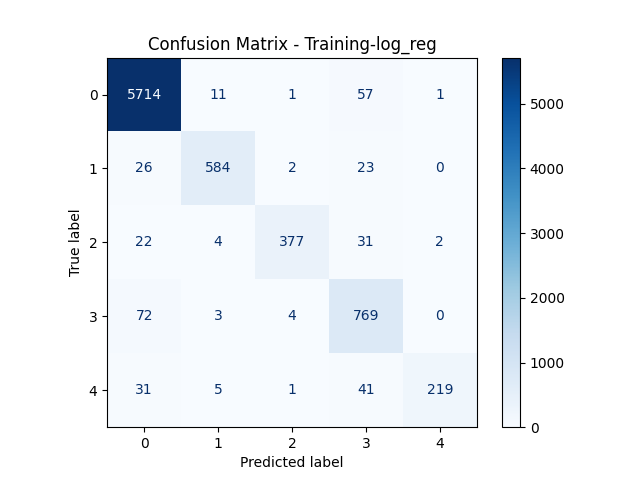
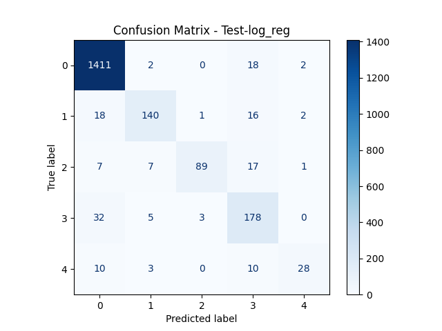

### RAG Evaluation

This project does Automatic Ticket classification by following methods
- preprocess data (clean, lemmantize, extract pos tags)
- perform EDA, Extract features using TF IDF, 
- Do topic modelling using NMF clustering 
- Assign topics manually 
- Train the data using sklearn 
- Infer results

**Version**
- `python==3.12`

**Setup**
- Download data from `wget -O complaints.json "https://raw.githubusercontent.com/sukhijapiyush/NLP-Case-Study---Automatic-Ticket-Classification/refs/heads/master/complaints-2021-05-14_08_16.json"` and place it in `data/` folder
- modify load_data(data_num) as needed.
- Install uv and create environment
- Run in terminal `uv pip install requirements.txt`
- Run in terminal `plotly_get_chrome` - for saving images using ploty

**Run**
- `python ticket_classification.py`

**Results**

**Logistic Regression Results**

References
1. [source repo](https://github.com/sukhijapiyush/NLP-Case-Study---Automatic-Ticket-Classification/tree/master)